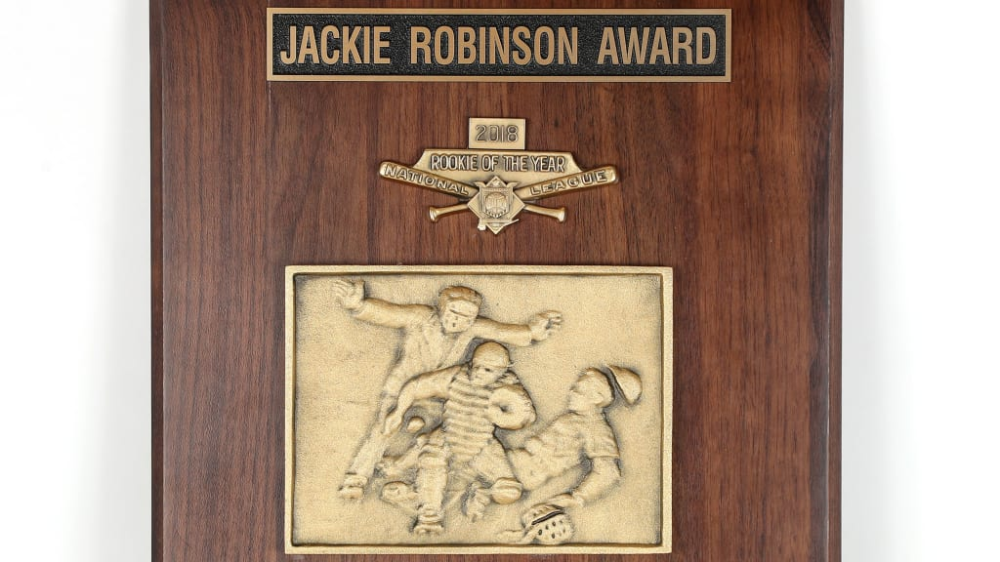

```{r echo=FALSE, message=FALSE, warning=FALSE}
library(cowplot)
library(magick)

# Load the images
img1 <- ggdraw() + draw_image("../images/paul_skenes.jpg", scale = 1)
img2 <- ggdraw() + draw_image("../images/jackson_merrill.jpeg", scale = 1)

# Combine images into one plot, ensuring same dimensions
plot_grid(img1, img2, ncol = 2, 
          rel_heights = c(2, 0.65))  # Keep the relative widths the same

```

```{r echo=FALSE, fig.align='center', message=FALSE, warning=FALSE}

```

\newpage

```{=latex}
\hypersetup{linkcolor=black}
\setcounter{tocdepth}{4}
\tableofcontents
\hypersetup{linkcolor=blue}
```
\newpage

```{r setup, include=FALSE}
knitr::opts_chunk$set(echo = TRUE)
library(tidyverse)
library(kableExtra)
```

# Introduction

The Rookie of the Year race has raised significant debate throughout the
MLB, with Paul Skenes, Jackson Chourio, and Jackson Merrill leading in
the NL, and Colton Cowser, Austin Wells, and Luis Gil in the AL. This
has been a stellar production year for rookie batters as they have the
6th highest FanGraphs `WAR` (fWAR) since 1974 and the highest since
2002. This speaks for the quality of talent in this draft class and
offers some explanation for why the Rookie of the Year races have been
so close at this point in the season.

While looking at rookie stats recently I found myself questioning who
should be Rookie of the Year in both leagues. I took it upon myself to
give my best effort at determining who should be Rookie of the Year. I
aim to provide objective statistical analysis and eliminate any personal
bias.

When I began this project on September 2nd, 2024 the odds were as seen
below:

[Click Here to View Rookie of the Year Odds
Source](https://www.actionnetwork.com/mlb/updated-mlb-mvp-cy-young-and-rookie-of-the-year-odds)

## Rookie of the Year Odds (as of Sep. 2, 2024)

These odds were sourced from **FanDuel** according to the source.

```{r echo=FALSE}
# Create the AL data frame with odds as strings
old_AL_roy_odds <- tibble(
  Player = c("Colton Cowser", "Austin Wells", "Colton Keith", "Wilyer Abreu"),
  Odds = c("-230", "+170", "+1000", "+2800"),
  `Implied Probability` = c("69.70%", "37.04%", "9.09%", "3.45%")
)

old_AL_roy_odds %>%
  kbl(caption = "\\textbf{American League Rookie of the Year Odds}", booktabs = TRUE,
      format = "latex", linesep="") %>% 
  kable_styling(latex_options = c("HOLD_position"),
                font_size = 12) %>% 
  row_spec(0, bold = TRUE, background = "#e6e6fa", align = "c") %>% 
  row_spec(1:4, background = "#fffddb", align="c")
```

In the American League, Colton Cowser has been the odds favorite all
year, but Austin Wells is not far behind. Cowser and Wells have both
played well, but Cowser is an outfielder and there's some positional
bias for them to win Rookie of the Year. Cowser shouldn't be number one,
Wells has been better and the second problem is that Mason Miller is
nowhere in sight. Despite this there has been some positive odds shift.

```{r echo=FALSE}
# Create the NL data frame with odds as strings
old_NL_roy_odds <- tibble(
  Player = c("Jackson Merrill", "Paul Skenes", "Jackson Chourio", "Shota Imanaga", "Masyn Winn"),
  Odds = c("-900", "+550", "+2800", "+20000", "+20000"),
  `Implied Probability` = c("90.00%", "15.38%", "3.45%", "0.50%", "0.50%")
)

old_NL_roy_odds %>%
  kbl(caption = "\\textbf{National League Rookie of the Year Odds}", booktabs = TRUE,
      format = "latex", linesep="") %>% 
  kable_styling(latex_options = c("HOLD_position"),
                font_size = 12) %>% 
  row_spec(0, bold = TRUE, background = "#e6e6fa", align = "c") %>% 
  row_spec(1:5, background = "#fffddb", align="c")
```

## Rookie of the Year Odds (as of Sep. 17, 2024)

```{r echo=FALSE}
# Create the AL data frame
AL_roy_odds <- tibble(
  Player = c("Luis Gil", "Austin Wells", "Colton Cowser"),
  MGM = c("+110", "+150", "+225"),
  `ESPN BET` = c("+135", "+145", "+225"),
  Caesars = c("+100", "+125", "+220"),
  `Draft Kings` = c("+110", "+160", "+230"),
  FanDuel = c("+120", "+175", "+210"),
  `Average Odds` = c("+115", "+151", "+222")
)

AL_roy_odds %>%
  kbl(caption = "\\textbf{American League Rookie of the Year Odds}", booktabs = TRUE,
      format = "latex", linesep="") %>% 
  kable_styling(latex_options = c("HOLD_position", "scale_down"),
                font_size = 12) %>% 
  row_spec(0, bold = TRUE, background = "#e6e6fa", align = "c") %>% 
  row_spec(1:3, background = "#fffddb", align="c")
```

Luckily for the AL the odds have shifted towards the better players.
Luis Gil is now readily the favorite surging up the odds due to his
resounding performance in his last 2 starts. Cowser has been slumping
this past month as a whole, and especially hard since August 31st. Wells
has also been slumping a bit since August 31st but overall he's
significantly outperformed Cowser in every way since August 1st.

```{r echo=FALSE}
# Create the NL data frame
NL_roy_odds <- tibble(
  Player = c("Jackson Merrill", "Paul Skenes", "Jackson Chourio"),
  MGM = c("-500", "+225", "+3000"),
  `ESPN BET` = c("-425", "+260", "+3300"),
  Caesars = c("-625", "+220", "+2200"),
  `Draft Kings` = c("-600", "+280", "+3000"),
  FanDuel = c("-340", "+220", "+4000"),
  `Average Odds` = c("-498", "+241", "+3100")
)

NL_roy_odds %>%
  kbl(caption = "\\textbf{National League Rookie of the Year Odds}", booktabs = TRUE,
      format = "latex", linesep="") %>% 
  kable_styling(latex_options = c("HOLD_position", "scale_down"),
                font_size = 12) %>% 
  row_spec(0, bold = TRUE, background = "#e6e6fa", align = "c") %>% 
  row_spec(1:3, background = "#fffddb", align="c")
```

The NL odds have not shifted significantly at this point. While there
has been some movement in favor of Skenes, Jackson Merrill remains the
heavy favorite with an $83.28\%$ implied probability to win.

# Understanding the Data

The data utilized in the models was sourced from FanGraphs using their
custom report function

## Cleaning/Pre-processing

To avoid overwhelming the report with excessive detail, I have omitted
the full data cleaning and pre-processing discussion. If you are
interested please look no further than the [Data Cleaning Python
Notebook](https://github.com/pddiii/MLB-ROY/blob/main/scripts_and_notebooks/roy_cleaning.ipynb)
linked here.

## Training/Testing Data

-   From 1974-2024
    -   Excluded the 1994, and 2020 seasons (since they were shortened)
    -   Split by Season
-   Included both MLB specific and Rookie specific data (separated)
-   Split into
    -   Relievers
    -   Starters
    -   Batters
-   Data Conditions
    -   Relievers: minimum of 40 Innings Pitched (IP)
    -   Starters: minimum of 100 Innings Pitched (IP)
    -   Batters: minimum of 300 Plate Appearances (PA)

## Prediction Data

-   From 2024 Season
-   Same splits and conditions as above

## Other Data

This analysis incorporates data sourced from Stathead, specifically
focusing on spans of pitchers during the early stages of their careers
and further discussion about their general performance.

# Let's talk about the Past

## Proportions of Each Position

```{=latex}
\begin{figure}[H]
  \centering
  \includegraphics[width=0.8\textwidth]{../images/pos_prop_barplot.png}
  \caption{Proportions of Each Position}
\end{figure}
```
There are a ton of relievers and starters, and there are barely any
catchers, closers, or designated hitters (DH) within the data. This is
important to keep in mind for further interpretation of the data
presented after this point. It is important to note the positions
because it deeply affects the models ability to learn. While `lightgbm`
is an ensemble method that, along with hypertuning, can perform well
with limited data, having more observations generally improves
performance by exposing the model to more variability. This implies
these models might be sensitive to the less frequented positions.

## Proportions of Rookie of the Year (by Position)

```{=latex}
\begin{figure}[H]
  \centering
  \includegraphics[width=0.8\textwidth]{../images/pos_prop_roy.png}
  \caption{Proportions of Each Position}
\end{figure}
```
I want to focus on with the data in particular is the positions of the
players. Batters are overwhelmingly favored every year over pitchers
(they've won $73.5\%$ of the awards since 1974). This is important to
know because it likely suggests a positional bias, or perhaps hesitancy
to vote for pitchers for Rookie of the Year. It's a weird bias, but it
seems very real.

Keep in mind less than $1\%$ of the training data was made up by DHs,
and a lot of these guys are elite talents such as Yordan Alvarez, and
Shohei Ohtani. I wanted to make this clear so people don't assume being
a DH automatically wins Rookie of the Year, they're just really talented
hitters. Who doesn't love to watch some great hitting?

# Modeling Rookie of the Year

For both of my models I utilized the `lightgbm` interface in Python to
create two binary classification models. I developed separate models for
each positional group: relievers, starters, and batters. Each of these
positions had different predictors however the pitching models, did
share significant overlap in columns overall.

In addition to this, I used `hyperopt` for hyper-parameter tuning the
models.

For my models I decided to create predictive models to model two
distinct topics:

-   Who will receive a vote this year? (`vote_getter`)
-   Who will win Rookie of the Year? (`rookie_of_the_year`)

## Who will receive votes?

Predicted Variable: `vote_getter`

Predicted Output Format: Probability (between 0 and 1)

Levels of `vote_getter`:

-   0 = Did NOT receive a vote
-   1 = Received at least 1 vote

### Choosing Recipients across Positions

For the `vote_getter` model, which was trained using positional data
sets, predictions were generated based on the predicted class
probabilities. After grouping all players by league (AL or NL), the top
8 probabilities were selected from each league. While this method for
selecting vote recipients may not be flawless, it seemed the best
approach for comparing across positional groups.

### Results

```{r echo=FALSE}
# Create the tibble
classification_report <- tibble(
  category = c('0', '1', 'macro avg', 'weighted avg'),
  precision = c(0.95, 0.56, 0.76, 0.91),
  recall = c(0.94, 0.61, 0.78, 0.91),
  `F1-Score` = c(0.95, 0.58, 0.77, 0.91),
  n = c(190, 23, 213, 213)
)

classification_report %>%
  kbl(caption = "\\textbf{ Relievers Vote Model Report}", booktabs = TRUE,
      format = "latex", linesep="") %>% 
  kable_styling(latex_options = c("HOLD_position", "scale_down"),
                font_size = 12) %>% 
  row_spec(0, bold = TRUE, background = "#e6e6fa", align = "c") %>% 
  row_spec(1:4, background = "#fffddb", align="c")
```

```{r echo=FALSE}
classification_report <- tibble(
  category = c('0', '1', 'macro avg', 'weighted avg'),
  precision = c(0.82, 0.67, 0.75, 0.77),
  recall = c(0.79, 0.71, 0.75, 0.76),
  `F1-Score` = c(0.81, 0.69, 0.75, 0.76),
  n = c(87, 52, 139, 139)
)


classification_report %>%
  kbl(caption = "\\textbf{ Starters Vote Model Report}", booktabs = TRUE,
      format = "latex", linesep="") %>% 
  kable_styling(latex_options = c("HOLD_position", "scale_down"),
                font_size = 12) %>% 
  row_spec(0, bold = TRUE, background = "#e6e6fa", align = "c") %>% 
  row_spec(1:4, background = "#fffddb", align="c")
```

```{r echo=FALSE}
classification_report <- tibble(
  category = c('0', '1', 'macro avg', 'weighted avg'),
  precision = c(0.80, 0.83, 0.82, 0.82),
  recall = c(0.81, 0.82, 0.82, 0.82),
  `F1-Score` = c(0.81, 0.83, 0.82, 0.82),
  n = c(105, 120, 225, 225)
)


classification_report %>%
  kbl(caption = "\\textbf{ Batters Vote Model Report}", booktabs = TRUE,
      format = "latex", linesep="") %>% 
  kable_styling(latex_options = c("HOLD_position", "scale_down"),
                font_size = 12) %>% 
  row_spec(0, bold = TRUE, background = "#e6e6fa", align = "c") %>% 
  row_spec(1:4, background = "#fffddb", align="c")
```

We can see from the three tables above that the model for Batters
overall did the best ($\text{macro F1-Score} = 0.82$), then the model
for Relievers ($\text{macro F1-Score} = 0.77$) , and then Starters
($\text{macro F1-Score} = 0.75$).

I want to remark that the Batters and Starters had much more consistent
performance despite lower macro F1-Scores. Meanwhile the Relievers
performance was heavily carried by the near perfect precision of the
negative class (0s). In fact the precision for the positive class was
rather abysmal, however I more concerned with overall performance.

### 2024 Rookie of the Year Votes

```{r echo=FALSE}
vote_preds_df <- read_csv('../data/predictions/vote_preds.csv', show_col_types=FALSE)

vote_preds_df <-
  vote_preds_df %>% 
  mutate(vote_getter = round(vote_getter, 2))

al_tbl <- 
  vote_preds_df %>% 
  filter(league == "AL") %>% 
  arrange(desc(vote_getter)) %>% 
  rename(`Vote Getter` = vote_getter) %>% 
  head(8)

al_tbl %>%
  kbl(caption = "\\textbf{American League Rookie Vote Getter Predictions}", booktabs = TRUE,
      format = "latex", linesep="") %>% 
  kable_styling(latex_options = c("HOLD_position", "scale_down"),
                font_size = 12) %>% 
  row_spec(0, bold = TRUE, background = "#e6e6fa", align = "c") %>% 
  row_spec(1:8, background = "#fffddb", align="c")
```

```{r echo=FALSE}
nl_tbl <- 
  vote_preds_df %>% 
  filter(league != "AL") %>% 
  arrange(desc(vote_getter)) %>%
  rename(`Vote Getter` = vote_getter) %>% 
  head(8)

nl_tbl %>%
  kbl(caption = "\\textbf{National League Rookie Vote Getter Predictions}", booktabs = TRUE,
      format = "latex", linesep="") %>% 
  kable_styling(latex_options = c("HOLD_position", "scale_down"),
                font_size = 12) %>% 
  row_spec(0, bold = TRUE, background = "#e6e6fa", align = "c") %>% 
  row_spec(1:8, background = "#fffddb", align="c")
```

Most of these predictions are reasonable. The NL Candidates as a whole
have been stronger this year than the AL. Additionally all the important
candidates (Merrill, Wells, Skenes, Cowser) were all predicted to
receive votes, so I'm happy with the performance of the model

## Who will win Rookie of the Year?

Predicted Variable: `rookie_of_the_year`

Predicted Output Format: Probability (between 0 and 1)

Levels of `rookie_of_the_year`:

-   0 = Did NOT win Rookie of the Year
-   1 = Did win Rookie of the Year

Utilized a similar selection process as the `vote_getter` model across
positions, utilizing the probabilities.

### Results

```{r echo=FALSE}
classification_report <- tibble(
  category = c('0', '1', 'macro avg', 'weighted avg'),
  precision = c(0.99, 0.00, 0.49, 0.97),
  recall = c(0.99, 0.00, 0.49, 0.97),
  `F1-Score` = c(0.99, 0.00, 0.49, 0.97),
  n = c(210, 3, 213, 213)
)  

classification_report %>%
  kbl(caption = "\\textbf{ Relievers Vote Model Report}", booktabs = TRUE,
      format = "latex", linesep="") %>% 
  kable_styling(latex_options = c("HOLD_position", "scale_down"),
                font_size = 12) %>% 
  row_spec(0, bold = TRUE, background = "#e6e6fa", align = "c") %>% 
  row_spec(1:4, background = "#fffddb", align="c")
```

```{r echo=FALSE}
classification_report <- tibble(
  category = c('0', '1', 'macro avg', 'weighted avg'),
  precision = c(0.99, 0.75, 0.87, 0.98),
  recall = c(0.99, 0.60, 0.80, 0.98),
  `F1-Score` = c(0.99, 0.67, 0.83, 0.98),
  n = c(134, 5, 139, 139)
)

classification_report %>%
  kbl(caption = "\\textbf{ Starters Vote Model Report}", booktabs = TRUE,
      format = "latex", linesep="") %>% 
  kable_styling(latex_options = c("HOLD_position", "scale_down"),
                font_size = 12) %>% 
  row_spec(0, bold = TRUE, background = "#e6e6fa", align = "c") %>% 
  row_spec(1:4, background = "#fffddb", align="c")
```

```{r echo=FALSE}
classification_report <- tibble(
  category = c('0', '1', 'macro avg', 'weighted avg'),
  precision = c(0.95, 0.50, 0.72, 0.90),
  recall = c(0.95, 0.50, 0.72, 0.90),
  `F1-Score` = c(0.95, 0.50, 0.72, 0.90),
  n = c(203, 22, 225, 225)
)


classification_report %>%
  kbl(caption = "\\textbf{ Batters Vote Model Report}", booktabs = TRUE,
      format = "latex", linesep="") %>% 
  kable_styling(latex_options = c("HOLD_position", "scale_down"),
                font_size = 12) %>% 
  row_spec(0, bold = TRUE, background = "#e6e6fa", align = "c") %>% 
  row_spec(1:4, background = "#fffddb", align="c")
```

Overall, none of the Rookie of the Year models performed exceptionally
well, which was expected. It's relatively straightforward to identify
who is unlikely to win the award; the real challenge lies in predicting
the winner. The objective of this model was not to definitively select
the Rookie of the Year, but rather to explore which factors the model
considers most relevant for making such a prediction and to highlight
the information that may be most important.

Aside from the difficulty in predicting the best rookie, another reason
for the lackluster performance could be the lack of data. We have a
total of 98 Rookie of the Year winners in our data. Only 10 of those
were relievers, 16 who were starters, and 72 who were batters. This
means there's a relative lack of positive data for the pitchers overall.

### 2024 Rookie of the Year Predictions

```{r echo=FALSE}
roy_preds_df <- read_csv('../data/predictions/vote_roy_preds.csv', show_col_types=FALSE)

roy_preds_df <-
  roy_preds_df %>% 
  mutate(rookie_of_the_year = round(rookie_of_the_year, 2))

al_tbl <- 
  roy_preds_df %>% 
  filter(league == "AL") %>% 
  arrange(desc(rookie_of_the_year)) %>% 
  rename(`Rookie of the Year` = rookie_of_the_year) %>% 
  head(8)

al_tbl %>%
  kbl(caption = "\\textbf{American League Rookie of the Year Predictions}", booktabs = TRUE,
      format = "latex", linesep="") %>% 
  kable_styling(latex_options = c("HOLD_position", "scale_down"),
                font_size = 12) %>% 
  row_spec(0, bold = TRUE, background = "#e6e6fa", align = "c") %>% 
  row_spec(1:8, background = "#fffddb", align="c")
```

Surprisingly, Cade Smith is the top predicted candidate, and Colton Cowser, and Luis Gil rounds off the top 3. To my surprise Mason Miller, who's
been exceptional this year, isn't even in the top 8.

```{r echo=FALSE}
nl_tbl <- 
  roy_preds_df %>% 
  filter(league != "AL") %>% 
  arrange(desc(rookie_of_the_year)) %>%
  rename(`Rookie of the Year` = rookie_of_the_year) %>% 
  head(8)

nl_tbl %>%
  kbl(caption = "\\textbf{National League Rookie of the Year Predictions}", booktabs = TRUE,
      format = "latex", linesep="") %>% 
  kable_styling(latex_options = c("HOLD_position", "scale_down"),
                font_size = 12) %>% 
  row_spec(0, bold = TRUE, background = "#e6e6fa", align = "c") %>% 
  row_spec(1:8, background = "#fffddb", align="c")
```

There were major surprises in the National League predictions. Merrill and Chourio have
undoubtedly been the two best batters, yet Chourio has the 4th highest odds. However, the low ranking of Paul
Skenes and Shota Imanaga is intriguing, and it’s unclear what factors are causing the
model to downplay their odds. It could be due to the lower win rate for
starting pitchers, but the reasoning isn't entirely clear.

# Who has been the Best?

## Relievers

**Cade Smith (Cleveland Guardians)**

Cade Smith remains the strongest candidate for Rookie of the Year among
relief pitchers. Smith demonstrates incredible overall performance. He
excels in key pitching metrics such as `ERA-` (3rd best), `WHIP+` (4th best),
and `WAR` (Rookie Leader), showing a well-rounded ability to
dominate on the mound. His high `IP` rank (Rookie Leader)
indicates that he consistently performs across many innings, a crucial
factor for maintaining reliability throughout the season. His
consistency across important categories, including `FIP-` (Rookie Leader), `HR/9+` (Rookie Leader), and `K/BB+` (2nd best), suggests
that he effectively limits home runs, strikes out more batters than he
walks, and maintains control over the game while on the mound. Cade
Smith has truly shown the makings of a standout rookie pitcher with
hall-of-fame potential, even though Cooperstown and Rookie of the Year
voters tend to overlook relief pitchers.

**Mason Miller (Oakland Athletics)**

Mason Miller, also shows promise, particularly with his `WAR/IP` (rookie leader), `K%+` (rookie leader), and rookie leading SD
(shutdowns), but he trails Smith in several other key metrics, such as
`ERA-` (6th best) and `K/BB+` (3rd best), keeping him behind Smith in overall
performance. Miller’s slightly lower `IP` rank indicates that he hasn’t logged as many innings as Smith,
which may impact his candidacy for Rookie of the Year. However one can
never expect a closer to really log the same amount of innings as an
ordinary reliever.

```{r echo=FALSE, message=FALSE, warning=FALSE}
rookie_relievers <- read_csv('../data/cleaned/relief_model_train.csv')
rookie_relievers_24 <- read_csv('../data/cleaned/relief_24_model_train.csv')

rookie_relievers_tbl <- 
  bind_rows(rookie_relievers %>% 
            mutate(`SD-int` = SD * SD_pct) %>% 
            select(Season, Name, league, `ERA-`, `FIP-`, `WHIP+`, `SD-int`,
                   `WAR/IP`),
          rookie_relievers_24 %>% 
            mutate(`SD-int` = SD * SD_pct) %>% 
            select(Season, Name, league, `ERA-`, `FIP-`, `WHIP+`, `SD-int`,
                   `WAR/IP`)
            ) %>% 
  mutate(across(c(`ERA-`, `FIP-`, `WHIP+`), 
                ~min_rank(.)),
         across(c(`WAR/IP`, `SD-int`),  ~min_rank(desc(.)))) %>% 
  rowwise() %>%
  mutate(`Average Rank` = mean(c(`ERA-`, `FIP-`, `WHIP+`, `SD-int`,
                   `WAR/IP`)),
         `Average Rank` = round(`Average Rank`, 2)) %>%
  ungroup() %>%
  select(Name, `ERA-`, `FIP-`, `WHIP+`, `SD-int`,
                   `WAR/IP`, `Average Rank`) %>% 
  arrange(`Average Rank`) %>% 
  head(10)

rookie_relievers_tbl %>%
  kbl(caption = "\\textbf{Best Rookie Relievers (Closer and Relief)}", 
      booktabs = TRUE,
      format = "latex", linesep="") %>% 
  kable_styling(latex_options = c("HOLD_position", "scale_down"),
                font_size = 12) %>% 
  row_spec(0, bold = TRUE, background = "#e6e6fa", align = "c") %>% 
  row_spec(1:10, background = "#fffddb", align="c")
```

The data in the table above came from the training/testing data from
FanGraphs. I combined all relievers from 1974 to 2024, and focused on
`ERA-`, `FIP-`, `WHIP+`, `WAR/IP`, and `SD-int`. `SD-int` was calculated
by

$$\text{SD-int} = \text{Number of Shutdowns} * \frac{\text{Number of Shutdowns}}{\text{Number of Shutdowns + Number of Meltdowns}}$$

The `Average Rank` was calculated by taking the average of the
aforementioned 5 statistics. We can see that Cade Smith is having a
historically dominant seasons among all relievers. He has the 7th best
season among Rookie Relievers according to this ranking. This is
incredible, and puts him in competition with the most dominant rookie
relievers such as 2006 Jonathan Papelbon, 2014 Dellin Betances, and 2006
Takashi Saito. He even outpaces fellow Guardians Reliever Emmanuel Clase
who has been the best Closer in the MLB since 2019.

**The Reliever Rookie of the Year**

Overall, Cade Smith’s consistent excellence throughout the season,
particularly his performance across multiple key metrics, makes him the
better choice for Rookie of the Year among these pitchers.

\newpage

## Starters

**Paul Skenes (Pittsburgh Pirates)**

Paul Skenes is the clear standout candidate for Rookie of the Year among
the four starting pitchers (predicted to receive votes). He ranks 1st in
the rookie category and 4th in the MLB, showcasing his dominance among
both rookies and across the league. His performance metrics are
outstanding, as the rookie leader in key categories such as `ERA-`,
`FIP-`, `HR/9+`, `WHIP+`, `WAR`, `K%+`, and `WPA`. This demonstrates his
all-around effectiveness in run prevention, strikeouts, and overall
contribution to team success. His high `WAR/IP` rank (rookie leader) and strong
control (`K/BB+` - 3rd best) further solidify his case as the top
rookie, making him one of the most well-rounded pitchers in his rookie
class. Additionally he has been the 4th highest rank pitcher in the MLB.

Skenes' rapid ascent to the MLB and dominance in nearly every category
makes his rookie season even more impressive. At just 22 years old and
within a year of being drafted, Skenes has already established himself
as a dominant pitcher in the league.

Overall, Paul Skenes’ consistency and excellence across all major
categories make him the clear choice for Rookie of the Year among these
starting pitchers. His youth, rapid development, and nearly flawless
performance metrics place him far ahead of his peers.

```{r include=FALSE}
Stathead_span <- read_csv('../data/Stathead/Stathead_rookie_span.csv')
```

It’s important to emphasize just how dominant Paul Skenes has been, even
more so than commonly perceived. Using Stathead, I analyzed all rookie
starting pitchers' first 21 games, focusing specifically on those with
at least 100 innings pitched — about the same amount as Skenes' innings
at the time of data collection.

```{r echo=FALSE}
span_tbl <-
  Stathead_span %>% 
  mutate(across(c(WPA, H, HR, BB, SO, BF, BR), ~ . / IP),
         across(c(WPA, SO), ~ min_rank(desc(.))),
         across(c(ERA, H, HR, BB, BF, BR),
                ~ min_rank(.))) %>% 
  rowwise() %>% 
  mutate(`Average Rank` = mean(c(WPA, ERA, BF,
                            BR))) %>% 
  ungroup() %>% 
  select(Player, WPA,
         ERA, BF, BR, `Average Rank`) %>%
  rename(`WPA/IP` = WPA,
         `BF/IP` = BF, 
         `BR/IP` = BR) %>% 
  arrange(`Average Rank`) %>% 
  head(5)

span_tbl$Player[3] <- "Jose Fernandez"

span_tbl %>%
  kbl(caption = "\\textbf{Best Rookie Starting Pitcher (in first 20 games)}", 
      booktabs = TRUE,
      format = "latex", linesep="") %>% 
  kable_styling(latex_options = c("HOLD_position", "scale_down"),
                font_size = 12) %>% 
  row_spec(0, bold = TRUE, background = "#e6e6fa", align = "c") %>% 
  row_spec(1:5, background = "#fffddb", align="c")
```

For the Stathead span data, the focus was on identifying the statistics
that best capture pitcher dominance. The key metrics chosen for this
analysis were
`'WPA (Win Probability Added)', 'ERA', 'BF (batters faced)', and 'BR (baserunners allowed)'`.
For cumulative stats, such as WPA, BF, and BR, these were normalized to
a per innings pitched rate by dividing each by `IP`, given that many of
the pitchers in the comparison, such as Hideo Nomo and Fernando
Valenzuela, have significantly more innings pitched than Skenes.

As shown in the table above, Skenes has been exceptional in these
categories. He ranks the highest in `WPA/IP`, `BF/IP`, and `BR/IP` while
ranking second in ERA. This dominance across the board results in Skenes
having the lowest average rank in these key metrics, outperforming Hall
of Famer Fernando Valenzuela and future Hall of Famer Chris Sale. Skenes
may very well have the most dominant start to a starter's career since
1974.

```{r echo=FALSE, message=FALSE, warning=FALSE}
rookie_starters <- read_csv('../data/cleaned/starter_model_train.csv')
rookie_starters_24 <- read_csv('../data/cleaned/starter_24_model_train.csv')

rookie_starters_tbl <- 
  bind_rows(rookie_starters %>% 
            select(Season, Name, league, `ERA-`, `FIP-`, `WHIP+`, 
                   `WAR/IP`),
          rookie_starters_24 %>% 
            select(Season, Name, league, `ERA-`, `FIP-`, `WHIP+`, 
                   `WAR/IP`)) %>% 
  mutate(across(c(`ERA-`, `FIP-`, `WHIP+`), 
                ~min_rank(.)),
         across(c(`WAR/IP`),  ~min_rank(desc(.)))) %>% 
  rowwise() %>%
  mutate(`Average Rank` = mean(c(`ERA-`, `FIP-`, `WHIP+`, `WAR/IP`)),
         `Average Rank` = round(`Average Rank`, 2)) %>%
  ungroup() %>%
  select(Name, `ERA-`, `FIP-`, `WHIP+`, `WAR/IP`, `Average Rank`) %>% 
  arrange(`Average Rank`) %>% 
  head(5)

rookie_starters_tbl %>%
  kbl(caption = "\\textbf{Best Rookie Starting Pitcher Seasons}", 
      booktabs = TRUE,
      format = "latex", linesep="") %>% 
  kable_styling(latex_options = c("HOLD_position", "scale_down"),
                font_size = 12) %>% 
  row_spec(0, bold = TRUE, background = "#e6e6fa", align = "c") %>% 
  row_spec(1:5, background = "#fffddb", align="c")
```

The data in the table above came from the training/testing data from
FanGraphs. I combined all starters from 1974 to 2024, and focused on
`ERA-`, `FIP-`, `WHIP+`, `WAR/IP` then ranked all the starters. The
`Average Rank` is the mean of these 5 variables. From this data we can
see Skenes has been dominant. Since 1974 he has the second best `ERA-`,
the fifth best `FIP-`, and is top 10 in both `WHIP+` and `WAR/IP`. Only
one other pitcher in this data has done the same, 2001 NL Rookie of the
Year runner-up (to Albert Pujols), Roy Oswalt. All baseball fans should
recognize that we are currently witnessing history among rookies with
this performance.

## Batters

The standout candidate for Rookie of the Year in the NL would be Jackson
Merrill (NL).

**NL Candidate: Jackson Merrill (SDP)**

Jackson Merrill stands out in the NL as the highest-rated rookie batter
in the MLB. His `WAR` rank (rookie leader) and `WPA` (rookie leader) show that he consistently delivers both in terms of
overall value and in contributing to team wins. Merrill also
demonstrates a dominant offensive game, with high marks in `wRC+`
(2nd best), `SLG+` (rookie leader), and `ISO+` (2nd best). While his
`OBP+` (10th best) suggests room for improvement in getting on base, his
performance across multiple offensive metrics make him the most complete candidate in the NL.

**AL Candidate: Austin Wells (NYY)**

Austin Wells has been the top rookie batter in the AL, with strong ranks
in `WAR/G` (rookie leader), and `WAR` (3rd best). Aside from this his
high `OBP+` (3rd best) highlights his consistency to reach base offensively.
His stellar `Def` (rookie leader) further strengthens his case as
the top rookie in the AL, making him a worthy candidate for the award.

In summary, Jackson Merrill (NL) and Austin Wells (AL) would be the top
choices for Rookie of the Year based on their overall performance and
consistency. Surprising that the model didn't give Wells a chance to win.

# Who Should be Rookie of the Year?

## American League

Interestingly, the AL Rookie of the Year model performed well in
predicting the betting favorite. Cade Smith, Colton Cowser, Luis Gil, Spencer Horowitz and Wilyer Abreu were the top candidates according to the
model; Horowitz and Smith are not among the top favorites on any
betting platforms.

The AL Rookie of the Year race has become increasingly intriguing. Until
earlier this week, Colton Cowser had been the frontrunner. However,
Austin Wells has been on an impressive run since the All-Star break,
gradually climbing the ranks and ultimately overtaking Cowser. Luis Gil
has surged from a distant third place to become the overall betting
favorite.

In my opinion, Cade Smith deserves to win the AL Rookie of the Year over
Cowser. Cade Smith is having one of the best seasons since 1974 by a
rookie reliever. He has been dominant in `FIP-` suggesting he can
control the game without need of his fielders behind him, and he has
been excellent at shutting down the other teams hitters in his
appearances.

It’s also worth noting that Austin Wells was not featured in the model’s
Rookie of the Year predictions. Catchers have rarely won the Rookie of
the Year award (only three times since 1974), which may explain why
Wells is not favored (since Catchers are usually defensive specialists
and not much more).

## National League

The model for predicting vote recipients performed exceptionally well.
It accurately identified the top three candidates who are expected to
receive votes, all of whom were given the highest probabilities of being
selected.

The model for predicting the Rookie of the Year also did a solid job,
predicting that Merrill will win the
Rookie of the Year award. At this point it's likely that Merrill will
win the award in real life, but he shouldn't.

Paul Skenes is having a top 5 rookie pitching campaigns since 1974. The
odds in favor of Merrill likely stem from a positional bias that exists
in Rookie of the Year voting, where hitters are often favored over
pitchers.

Paul Skenes, based on his performance, should be the NL Rookie of the
Year.

# Conclusion

The Rookie of the Year race in 2024 has proven to be one of the most
competitive and debated in recent memory, with standout performances
across both leagues. We have identified key contenders for this
prestigious award. While players like Jackson Merrill and Colton Cowser
have dominated the conversation, our statistical approach has revealed
important nuances that might not be reflected in public perception or
betting odds.

In the American League, the competition has tightened considerably, with
Luis Gil surging late in the season. However, based on both performance
metrics and positional impact, Cade Smith has consistently outperformed
his rivals and is a deserving candidate for the award. Wells’ ability to
contribute as a reliever, a position historically underrepresented in
Rookie of the Year voting, sets him apart as the strongest contender.

In the National League, Jackson Merrill remains the betting favorite,
but our analysis suggests that Paul Skenes should be the frontrunner.
Skenes' performance as a rookie pitcher has been historically dominant,
placing him among the top rookie campaigns since 1974. Despite the
typical positional bias that favors batters in Rookie of the Year
voting, Skenes’ all-around excellence and ability to impact the game
make a compelling case for his selection.

Ultimately, the results of this analysis underscore the importance of
objective data in evaluating rookie performances. While public opinion
and positional bias may influence the final outcome, it is clear from
the numbers that both Smith and Skenes have demonstrated the highest
level of excellence in their respective leagues and are most deserving
of the 2024 Rookie of the Year awards.
